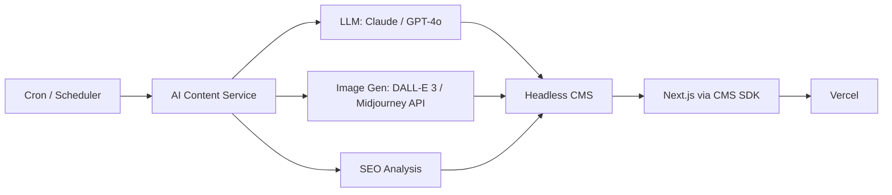
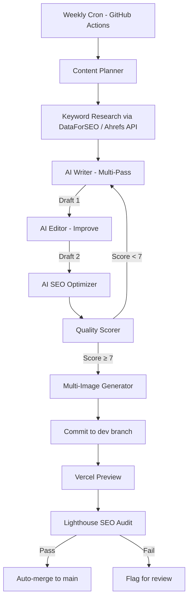

# 🧠 Brainstorm: AI Blog Automation — Production-Grade Alternatives

## Context

**You are a solo developer** running ERP Academy, a Next.js educational platform about SAP/ERP. You currently automate blog publishing via:

| Component | Current Choice | Problem |
|-----------|---------------|---------|
| **Orchestration** | n8n (self-hosted) | Fragile; hard to debug multi-step AI chains |
| **LLM** | Groq (`openai/gpt-oss-120b`) | Low-quality, generic output; not "well-written" |
| **Images** | Infip API (1 cover image) | Single image, poor positioning, no in-content images |
| **Content Format** | MDX committed to GitHub | Works, but no editing layer or quality gate |
| **SEO** | None | No keyword research, no schema markup, thin content hurting rankings |
| **Review** | Manual PR merge | Bottleneck for a solo dev |
| **Schedule** | Mon/Thu at 9 AM | Fixed; no awareness of trending topics |

### Root Causes of Your Problems

1. **Poor quality** → Low-tier LLM + zero-shot prompting with no revision loop
2. **Single image** → Pipeline only generates one cover image; MDX template has no multi-image support
3. **SEO damage** → Thin AI content without E-E-A-T signals, no keyword targeting, no internal linking
4. **No quality gate** → Content goes straight from generator to repo with no scoring or human-in-the-loop check

---

## Option A: **Enhanced n8n Pipeline (Upgrade In-Place)**

Keep your existing n8n + GitHub + Vercel stack but fix each pain point with targeted upgrades.

### What Changes

```
Schedule → Topic Research → AI Strategist → AI Writer (Claude/GPT-4o)
                                                   ↓
                                            AI Editor (revision loop)
                                                   ↓
                                        Multi-Image Generator (3-5 images)
                                                   ↓
                                        SEO Optimizer (schema, meta, links)
                                                   ↓
                                        Quality Scorer (≥ 7/10 → publish)
                                                   ↓
                                            Commit to dev → PR → Merge
```

| Change | How |
|--------|-----|
| **Better LLM** | Switch to Claude 3.5 Sonnet or GPT-4o via API (Groq also serves `llama-3.3-70b` which is better) |
| **Revision loop** | Add a second n8n node: "AI Editor" that reviews and rewrites the draft |
| **Multi-image** | Generate 3-5 images per post; embed at section breaks in MDX |
| **SEO layer** | Add a node that injects JSON-LD, meta description, keyword density check, internal links |
| **Quality gate** | AI scores the post 1-10; only publish if ≥ 7; otherwise retry or flag for review |
| **Topic awareness** | Replace hardcoded topics with a Google Trends API or SEMrush/Ahrefs API call |

✅ **Pros:**
- Minimal migration — you keep your existing infrastructure
- You already know n8n; fastest to implement
- Incremental: upgrade one node at a time
- Still free/low-cost if you use Groq's free tier with `llama-3.3-70b`

❌ **Cons:**
- n8n gets unwieldy with 15+ nodes and retry loops
- Still a brittle glue-code architecture; debugging multi-step AI chains in n8n is painful
- Limited error handling and observability
- No centralized content database (everything is files in Git)

📊 **Effort:** Low–Medium (1-2 weeks)
💰 **Cost:** $0-30/month (Groq free tier or GPT-4o mini at ~$0.15/1K tokens)

---

## Option B: **Headless CMS + External AI Pipeline**

Decouple content management from your codebase using a headless CMS. Run AI generation as a separate service.

### Architecture



| Component | Choice | Why |
|-----------|--------|-----|
| **CMS** | Sanity / Strapi / Contentful | Rich editor, image management, draft/publish workflow |
| **AI Service** | Small Node.js or Python script (GitHub Actions or Render cron) | Calls LLM, generates images, pushes to CMS |
| **Image hosting** | CMS built-in (Sanity has a CDN, Contentful has assets API) | Proper image management with responsive variants |
| **SEO** | CMS fields for meta, OG, schema | Structured, not hacked into frontmatter |

✅ **Pros:**
- **Proper content management**: rich text editor, image galleries, draft/review/publish workflow
- **Multi-image support** is native — CMS handles image uploads and positioning
- **SEO-friendly**: structured fields for meta tags, OG images, canonical URLs
- You can still manually edit AI content before publishing (solo dev friendly)
- Sanity free tier: 100K API requests/month, 10GB assets — more than enough
- Scales gracefully if you hire writers later

❌ **Cons:**
- Significant refactor: replace MDX file reading with CMS SDK calls
- Learning curve for CMS (though Sanity/Strapi are well-documented)
- Adds a dependency (CMS vendor)
- Slightly more complex deployment topology

📊 **Effort:** Medium (2-3 weeks)
💰 **Cost:** $0-30/month (Sanity free tier + LLM API costs)

---

## Option C: **GitHub-Native with AI Quality Pipeline (Production-Grade)**

Keep Git as your "CMS" but add a production-grade quality pipeline using GitHub Actions + a dedicated AI content microservice.

### Architecture



### Key Design Patterns

| Pattern | Application |
|---------|-------------|
| **Multi-pass generation** | Draft → Edit → SEO-optimize → Score → Retry if needed |
| **Quality gate** | AI scores content on readability, depth, uniqueness; auto-reject low scores |
| **Keyword-first authoring** | Research trending keywords BEFORE writing, weave them in naturally |
| **Multiple images in MDX** | Insert image placeholders at `## headings`, generate contextual images for each |
| **Internal linking** | AI suggests links to existing posts using your `index.json` as context |
| **Structured SEO** | Auto-generate JSON-LD `Article` schema, proper meta tags, OG images |

### MDX Template Upgrade

```mdx
---
# ... existing frontmatter
images:
  - url: "/assets/blog_images/slug-hero.webp"
    alt: "Hero image description"
    position: "hero"
  - url: "/assets/blog_images/slug-section1.webp"
    alt: "Section 1 illustration"
    position: "inline"
  - url: "/assets/blog_images/slug-section2.webp"
    alt: "Section 2 diagram"
    position: "inline"
seo:
  focusKeyword: "sap s/4hana migration"
  metaDescription: "..."
  schema: "Article"
---
```

✅ **Pros:**
- No new infrastructure (stays in GitHub + Vercel)
- Production-grade quality with multi-pass AI and quality gates
- True SEO optimization with keyword research baked in
- Multiple images per post with semantic placement
- Lighthouse audit as an automated check
- Internal linking improves site authority
- Fully automated end-to-end

❌ **Cons:**
- Complex GitHub Actions workflow (can be 200+ lines YAML)
- LLM API costs higher due to multi-pass (3-4x per post)
- Debugging failures requires reading Actions logs
- Git as a "database" for content has scaling limits
- Still no visual editor for quick edits

📊 **Effort:** Medium–High (2-4 weeks)
💰 **Cost:** $10-50/month (LLM API costs for multi-pass + image generation)

---

## Option D: **Fully Managed Blog Platform + AI Feed**

Stop self-hosting your blog. Use a platform that already handles SEO, images, and design. Push AI content to it via API.

### Options

| Platform | AI Integration | SEO | Cost |
|----------|---------------|-----|------|
| **Hashnode Headless** | Push articles via API; handles SEO, images, sitemap | Built-in SEO, auto-canonical | Free |
| **Ghost (self-hosted or Pro)** | Admin API for programmatic posting; rich editor, themes | Excellent SEO; AMP support | $0 (self-host) or $9/mo |
| **Medium** | No API for publishing (limited) | Strong domain authority but you don't own traffic | Free |
| **WordPress + Jetpack** | REST API for posting; 60k+ plugins | Yoast SEO, schema markup, sitemaps | $0 (self-host) or $4/mo |
| **Dev.to / Hashnode** | Content API; cross-post from your primary | Good SEO, built-in audience | Free |

### Recommended: Ghost

```
Weekly Cron → AI Writer (Claude) → Ghost Admin API → Auto-publish
                                         ↓
                                  Multiple images uploaded
                                  Meta tags auto-set
                                  Sitemap auto-updated
```

✅ **Pros:**
- **Zero frontend work** — Ghost handles blog design, SEO, images, responsive layouts
- Professional looking out of the box
- Built-in email newsletter, membership, analytics
- Great SEO defaults (structured data, sitemaps, canonical URLs)
- You can still embed the blog on your Next.js site via Ghost Content API
- Ghost self-hosted on Render/Railway = free-ish

❌ **Cons:**
- Adds a separate service to manage
- Your blog design is decoupled from your main Next.js site
- Ghost self-hosted needs maintenance (updates, backups)
- Less control over exact blog page design

📊 **Effort:** Low (1 week)
💰 **Cost:** $0-9/month

---

## Option E: **Static Site Generator + AI Content Pipeline (JAMstack)**

Use a dedicated SSG for the blog (Astro, 11ty, or Hugo) with a separate AI content pipeline.

### Architecture

```
AI Pipeline (Render Cron / GitHub Actions)
    ↓
Markdown files in /blog repo
    ↓
Astro/Hugo builds static HTML
    ↓
Deploy to Cloudflare Pages / Vercel
    ↓
Embed as subdomain: blog.erpacademy.com
```

### Why a Separate Blog SSG?

Your main site is a Next.js app for courses/academy. The blog is essentially static content. Separating concerns means:
- Blog can use markdown-native tools optimized for blogging
- Astro's Content Collections are purpose-built for blogs with multi-image support
- Build times are sub-second for 100+ posts

✅ **Pros:**
- Perfect Lighthouse scores (pure static HTML)
- Astro/Hugo have first-class blog support (image optimization, RSS, sitemaps, SEO)
- Separation of concerns: blog doesn't bloat your academy app
- Cheaper and faster than SSR
- Full control over design and content

❌ **Cons:**
- Two repositories / deployment pipelines to manage
- Design consistency between main site and blog requires effort
- Still need the AI pipeline (this option only changes the frontend)

📊 **Effort:** Medium (2-3 weeks)
💰 **Cost:** $0-5/month (Cloudflare Pages free tier)

---

## Cross-Cutting: What Production-Grade Systems Actually Do

Regardless of which option you pick, here are the **system design patterns** used by teams that do AI content at scale:

### 1. Multi-Agent Content Pipeline

```
Researcher → Writer → Editor → SEO Specialist → Quality Scorer → Publisher
```

Each "agent" is an AI call with a specific persona and task. The output of one feeds the next. This mimics a real editorial workflow and dramatically improves quality.

### 2. Quality Gate (Mandatory)

Before any post goes live, score it on:
- **Readability** (Flesch-Kincaid ≥ 60)
- **Uniqueness** (not rehashing your own existing content)
- **Depth** (word count ≥ 1200, has code examples, has data/stats)
- **SEO** (target keyword appears in H1, first paragraph, and at least 2 H2s)

If score < threshold → retry generation or flag for manual review.

### 3. Keyword-First Strategy

Don't generate random topics. Use tools to find **low-competition, high-volume** keywords:
- **Free**: Google Search Console data, Google Trends API, AnswerThePublic
- **Paid**: DataForSEO API ($50/mo), SEMrush ($120/mo), Ahrefs ($99/mo)

Feed the chosen keyword + search intent to the AI writer as context.

### 4. E-E-A-T Signals (Google's Quality Framework)

Google penalizes thin AI content. You need:
- **Experience**: Include real-world examples, personal tone
- **Expertise**: Cite sources, reference SAP documentation
- **Authority**: Internal links, author bio, byline
- **Trust**: Secure site, clear about page, privacy policy

### 5. Image Strategy

| Type | Purpose | How |
|------|---------|-----|
| **Hero image** | Attention +  OG share | DALL-E 3 or Flux (high quality) |
| **Section images** | Break up text, illustrate concepts | DALL-E 3 / Stable Diffusion |
| **Diagrams** | Architecture, workflows | Mermaid → SVG (generated by AI) |
| **Screenshots** | Real tool demos | Manual or automated tools |
| **Infographics** | Data visualization | Canva API or custom SVGs |

### 6. Human-in-the-Loop (Solo Dev Friendly)

Full automation ≠ zero oversight. The best solo-dev approach:

```
AI generates → Post goes to "Draft" state → You get a Telegram/Email notification
→ Quick 2-min scan → Approve or request regeneration → Auto-publish
```

This takes ~2 minutes per post vs ~2 hours writing from scratch.

---

## 💡 Recommendation

### For You (Solo Developer, AI Content, Minimal Intervention):

**Option C (GitHub-Native Quality Pipeline)** with elements from **Option A** (upgrade your n8n).

### Why?

| Factor | Reasoning |
|--------|-----------|
| **Solo dev** | You don't want to manage Ghost/Strapi/Sanity on top of your Next.js app |
| **Existing infra** | You already have n8n + GitHub + Vercel working; upgrading is less risky than migrating |
| **Quality** | Multi-pass AI + quality gate solves problems #1 and #3 (bad writing + SEO damage) |
| **Images** | Multi-image generation solves problem #2 |
| **Low effort** | You can implement incrementally: better LLM first → add editor pass → add SEO → add images |

### Prioritized Action Plan

| Priority | Action | Impact |
|----------|--------|--------|
| 🔴 P0 | Switch LLM to `llama-3.3-70b` on Groq (free) or GPT-4o-mini | Immediate quality boost |
| 🔴 P0 | Add "AI Editor" revision pass in n8n | Posts become well-structured |
| 🟡 P1 | Add quality scorer (reject < 7/10) | Stops bad posts from publishing |
| 🟡 P1 | Generate 3 images per post instead of 1 | Visual quality jumps |
| 🟢 P2 | Add keyword research step (Google Trends API) | Topics align with search demand |
| 🟢 P2 | Add JSON-LD schema + meta description generation | SEO signal boost |
| 🟢 P2 | Auto-generate internal links from `index.json` | Site authority boost |
| 🔵 P3 | Add Lighthouse CI check in GitHub Actions | Automated SEO verification |
| 🔵 P3 | Telegram/email notification for draft review | 2-min approval workflow |

> [!TIP]
> **Quick win**: Just switching from `gpt-oss-120b` to `llama-3.3-70b-versatile` on Groq (still free) and adding a single "rewrite and improve" step in n8n will solve 60% of your problems overnight.

---

**What direction would you like to explore?**
